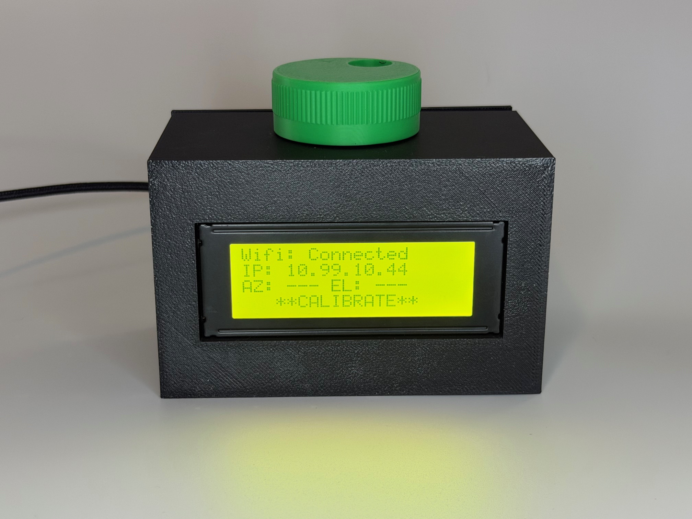
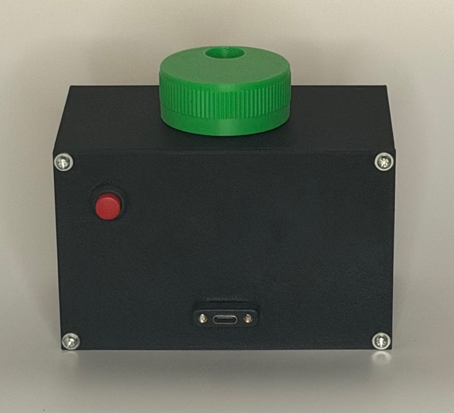
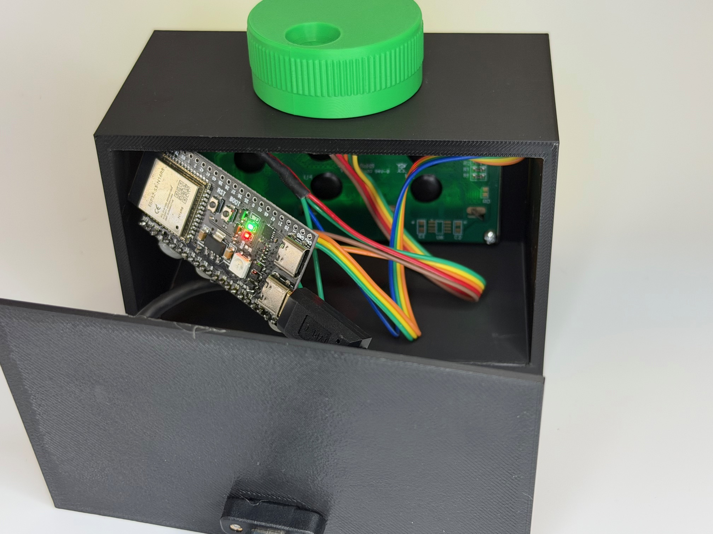
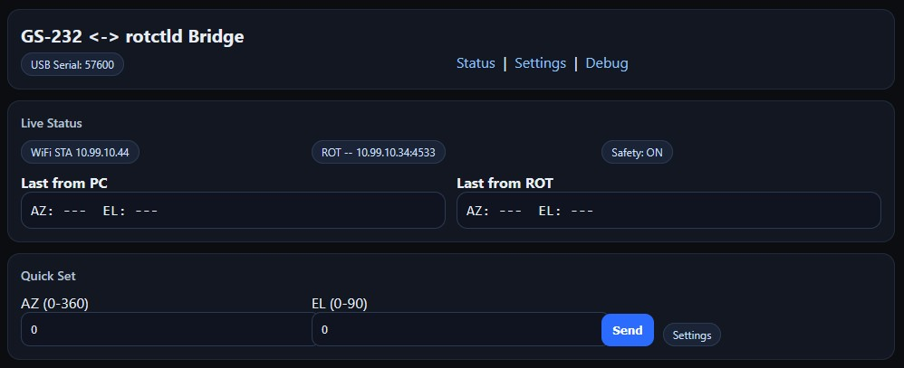
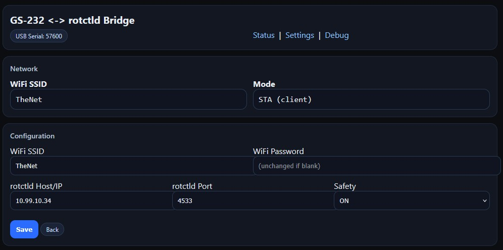
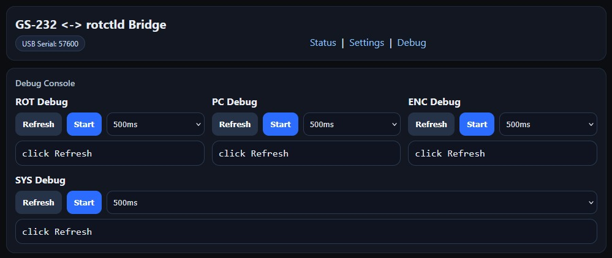

# W9KSB-Rotctld-Serial-Bridge

## SatPC32 Frequency Control Console

A purpose-built **ESP32-S3 satellite control console** that:

-   Emulates a **Yaesu GS-232** rotor controller for SatPC32
-   Bridges commands to a **Hamlib / rotctld network rotor**
-   Provides a **dedicated physical frequency tuning interface** for
    live satellite passes

This project works off of traditional GS-232 focused workflows while adding intuitive hardware-based frequency control. The future of the project may add other serial command syntaxes as well. Yes, I had AI assistance in the coding, but feel free to review the code for yourself. It works great for my personal use case! This project is provided for educational and hobby purposes only. Use at your own risk. I am not responsible for any damage resulting from construction or use.

------------------------------------------------------------------------

# 🎯 Project Goals

This project solves two real-world satellite operator problems. I know there are other mentioned ways to get this done for programs like SatPC32, but this one is easy to use for me and reliable. It's a personal value to me for my use cases, but sharing in case it helps someone else.

------------------------------------------------------------------------

## 1️⃣ GS-232 → Hamlib Network Bridge

SatPC32 expects a **serial rotor controller** such as a Yaesu GS-232.

Lots of rotors often expose control through **Hamlib (rotctld)** over
TCP/IP instead, especially those like the W9KSB antenna rotator that I designed, or others like the SatNOGS rotator..

This controller:

-   Emulates the **Yaesu GS-232 command language** as the first protocol, due to how popular and widely used it is.
-   Receives commands from SatPC32 over USB serial virtual com port
-   Translates them
-   Forwards position commands over the network to a rotctld-compatible
    rotor

This allows modern networked rotors to work seamlessly with 
GS-232-based software --- no original Yaesu controller required. This project has no Yaesu affiliation, but they are extremely popular (for good reason), so they were the syntax I went with.

------------------------------------------------------------------------

## 2️⃣ Dedicated Frequency Control Hardware

Satellite operation requires constant small adjustments:

-   Align TX to the satellite's RX "lane"
-   Correct small drift during a pass
-   Shift RX/TX together without breaking alignment

Using a mouse mid-pass is clumsy.

This controller provides a **rotary encoder with dual control modes**,
giving you physical, tactile frequency control during live operation. The controller is acting as a virtual keyboard simulating and sending specific key presses where needed.

------------------------------------------------------------------------

# 📸 Photos

## Device \ Hardware Views







## Web Interface





------------------------------------------------------------------------

# 🔧 Setup Process

## 1️⃣ Hardware Requirements

-   ESP32-S3 (native USB required)
-   I2C 20x4 LCD
-   EC11 rotary encoder with push button
-   Network connection (WiFi or Ethernet)
-   rotctld-enabled rotor
-   SatPC32 on Windows

# 🔌 Wiring & Pinout

Below is the reference wiring configuration used for this project.

> ⚠️ Adjust GPIOs if needed for your specific ESP32-S3 board variant.

---

## 📟 LCD (20x4 I2C)

| LCD Pin | ESP32-S3 Pin | Notes |
|----------|--------------|-------|
| VCC      | 5V           | Requires IN/OUT solder bridge for USB 5V output |
| GND      | GND          | Common ground |
| SDA      | GPIO 8       | I2C Data |
| SCL      | GPIO 9       | I2C Clock |

I2C speed configured at 400kHz.

---

## 🎛 Rotary Encoder (RAW EC11 – No Power Pin)

This is a **mechanical encoder**.  
It does NOT have a VCC pin.

It works by shorting signal pins to **common (ground)**.

### Encoder Rotation Pins

| Encoder Pin | ESP32-S3 Pin | Notes |
|-------------|--------------|-------|
| A (CLK)     | GPIO 4       | Input with internal pull-up |
| B (DT)      | GPIO 5       | Input with internal pull-up |
| C (Common)  | GND          | Connect to ground |

### Encoder Push Button

| Switch Pin | ESP32-S3 Pin | Notes |
|------------|--------------|-------|
| SW1        | GPIO 6       | Input with internal pull-up |
| SW2        | GND          | Connect to ground |


------------------------------------------------------------------------

## 2️⃣ Important: 5V Output (In/Out Solder Bridge)

To power external hardware from USB 5V:

-   The ESP32 board's **IN/OUT solder pads must be bridged**
-   This allows USB 5V to feed the 5V output rail

Without this solder bridge:

-   USB power will NOT appear on the 5V output pin

⚠️ Only bridge IN/OUT if you understand your power routing.\
Do not back-feed external supplies into USB.

------------------------------------------------------------------------

## 3️⃣ Flash Firmware

1.  Open Arduino IDE
2.  Select ESP32-S3 board
3.  Upload firmware
4.  Connect via USB-C

The device will appear as:

-   A USB Serial COM port (GS-232 emulator)

------------------------------------------------------------------------

## 4️⃣ WiFi Setup Options

You have two methods.

### Option A --- Hardcode WiFi Credentials

In the firmware:

``` cpp
const char* ssid = "YOUR_SSID";
const char* password = "YOUR_PASSWORD";
```

Upload and reboot. The device will auto-connect.

------------------------------------------------------------------------

### Option B --- Access Point Mode (First-Time Setup)

If WiFi credentials are not defined:

-   Device boots into AP mode
-   Connect to the controller's WiFi network
-   Open the configuration page in your browser
-   Enter SSID and password
-   Save and reboot

After that, the device joins your main network.

------------------------------------------------------------------------

## 5️⃣ Configure rotctld

In the Web Settings Panel:

-   Set rotctld IP address
-   Set rotctld port
-   Save and reboot

------------------------------------------------------------------------

## 6️⃣ Configure SatPC32

In SatPC32:

-   Rotor Type: **GS-232**
-   COM Port: ESP32 USB Serial device
-   Baud Rate: Match firmware
-   No hardware flow control

SatPC32 now controls your network rotor transparently.

------------------------------------------------------------------------

# 🖥 Web Interface Guide

## Settings Panel

The Settings Panel allows configuration of:

-   rotctld IP address
-   rotctld port
-   Serial baud rate
-   Network status
-   System configuration values

Changes require reboot to apply.

------------------------------------------------------------------------

## Debug Page

The Debug page shows:

-   Raw GS-232 commands received from SatPC32
-   Translated Hamlib commands
-   Network connection status
-   Current AZ/EL values
-   Error output

Useful for:

-   Troubleshooting SatPC32 configuration
-   Verifying protocol translation
-   Diagnosing network issues
-   Confirming rotor responses

------------------------------------------------------------------------

# 🎛 Encoder & Button Usage Guide

The rotary encoder is the primary physical control interface.

------------------------------------------------------------------------

## 🎚 Mode 1 --- TX Align Mode - ***CALIBRATE***

-   Adjusts **TX frequency only**
-   RX remains fixed
-   Used to align your uplink to the satellite's RX lane
-   Sends +/- keyboard commands (for SATPC32 and other software)

Ideal for:

-   Linear transponders
-   Fine centering in passband
-   Minor drift correction

------------------------------------------------------------------------

## 🔄 Mode 2 --- TX/RX Lane Adjust Mode - ***FREQUENCY CTRL***

-   Adjusts **RX and TX together**
-   Maintains frequency relationship
-   Moves working position up/down passband
-   Sends up/down arrow keyboard commands (for SATPC32 and other software)

Ideal for:

-   Repositioning within the satellite passband
-   Maintaining Doppler tracking alignment
-   Avoiding RX/TX desynchronization

------------------------------------------------------------------------

## 🔘 Encoder Push Button

The encoder button:

-   Switches between control modes
-   Updates LCD mode indicator
-   Immediately changes tuning behavior

The LCD displays:

-   WIFI Status
-   Client IP or AP HotSpot Credentials
-   Rotor position
-   Active Encoder knob mode: Calibrate or Frequency CTRL

------------------------------------------------------------------------

# 🧠 System Architecture

    SatPC32
       │  (GS-232 Serial over USB)
       ▼
    ESP32 Controller
       │  (TCP/IP)
       ▼
    rotctld
       ▼
    Hamlib-Compatible Rotor

Simultaneously:

    Encoder → Frequency Adjustments acting as virtual keyboard → SatPC32

------------------------------------------------------------------------

## 📦 Core Parts List

- ESP32-S3 (N16R8) - https://amzn.to/4cbqoCO
- 20x4 I2C LCD (HD44780 compatible) - https://amzn.to/4sc7sJ4
- EC11 rotary encoder (with pushbutton) - https://amzn.to/40cyK69
- USB-C panel-mount extension cable - https://amzn.to/4aJc4ir
- Breadboard jumper wires - https://amzn.to/3ZVG2uL
- Optional:
- Latching Pushbuttons (BOOT Mode) - https://amzn.to/40s9ysa

*These are the parts I ordered and used. Links below are affiliate links and I may earn a small commission on the sale at no additional cost to you.*

------------------------------------------------------------------------

# 📌 Status

Working with initial testing without issue.
